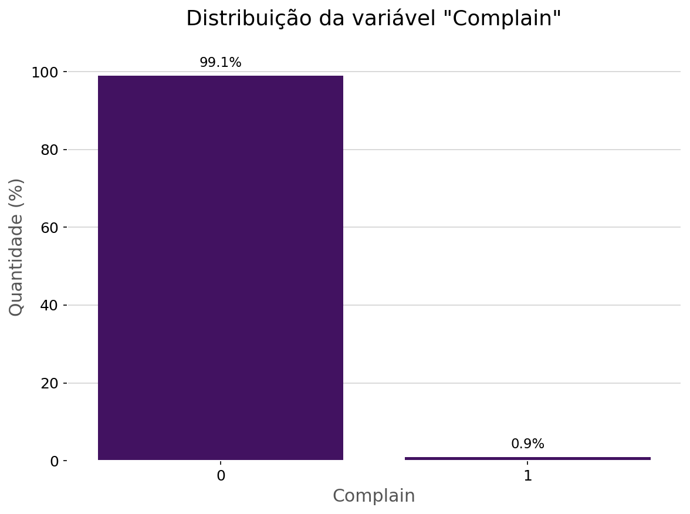

# Segmentação de Clientes utilizando Clusterização


[](https://github.com/pablo-francisco/img-preprocess-pipeline/blob/master/LICENSE)

***


## Introdução

Este projeto tem como objetivo demonstrar o uso de técnicas de clusterização para segmentar uma base de clientes. A técnica de clusterização foi aplicada utilizando um modelo que considera tanto variáveis contínuas quanto categóricas, o [k-prototypes](https://pypi.org/project/kmodes/), permitindo uma segmentação mais precisa e relevante.

 Variáveis como estado civil, nível de educação, e número de crianças em casa foram incluídas no modelo, além de variáveis contínuas como renda anual e gastos em diversas categorias de produtos. Essa abordagem permite capturar as nuances do comportamento dos clientes, resultando em clusters que refletem características distintas.


## Mas por que segmentar?


A segmentação de dados é uma prática essencial em qualquer estratégia de marketing e gestão de clientes. Ela permite que as empresas compreendam melhor os comportamentos, necessidades e preferências dos diferentes grupos de clientes, possibilitando a criação de estratégias personalizadas e mais eficazes. Algumas das grandes `empresas que utilizam a segmentação de clientes` são:


***

A seguir, são apresentados alguns motivos pelos quais a segmentação de dados é fundamental:

### 1. Personalização de Ofertas e Comunicação

Ao segmentar os clientes em grupos com características similares, é possível criar ofertas e campanhas de marketing altamente direcionadas. Por exemplo, um grupo de clientes que gasta mais em produtos de luxo pode receber ofertas exclusivas de alta qualidade, enquanto outro grupo mais sensível ao preço pode ser alvo de promoções e descontos.

### 2. Otimização de Recursos

Segmentar os clientes permite uma melhor alocação de recursos. Em vez de investir em campanhas genéricas que podem não ressoar com todos os clientes, as empresas podem focar seus esforços em segmentos específicos que oferecem maior potencial de retorno. Isso resulta em uma utilização mais eficiente do orçamento de marketing e em um melhor retorno sobre o investimento (ROI).

### 3. Melhoria na Experiência do Cliente

A segmentação possibilita a criação de experiências de cliente mais alinhadas com as expectativas e necessidades de cada grupo. Quando as empresas entendem as preferências e comportamentos dos diferentes segmentos, elas podem ajustar suas abordagens, desde o atendimento ao cliente até o design de produtos e serviços, para melhor atender cada grupo. Isso não só aumenta a satisfação do cliente, mas também promove a lealdade à marca.

### 4. Identificação de Oportunidades de Mercado

Através da segmentação, as empresas podem identificar nichos de mercado que antes passavam despercebidos. Esses nichos podem representar oportunidades valiosas para o desenvolvimento de novos produtos ou para a expansão em áreas que ainda não foram plenamente exploradas. A segmentação revela esses insights, permitindo que as empresas sejam mais proativas e inovadoras em suas estratégias.

### 5. Análise e Monitoramento de Performance

Segmentar os dados também facilita o monitoramento da performance de diferentes estratégias e campanhas. As empresas podem analisar como cada segmento responde a diferentes iniciativas e ajustar suas táticas em tempo real para maximizar os resultados. Além disso, a segmentação fornece uma visão clara sobre quais grupos estão impulsionando o crescimento e quais podem precisar de maior atenção.

### 6. Tomada de Decisão Baseada em Dados

Por fim, a segmentação de dados fornece uma base sólida para a tomada de decisões estratégicas. Em vez de tomar decisões baseadas em suposições ou generalizações, as empresas podem confiar em análises detalhadas de cada segmento para direcionar suas ações. Isso resulta em decisões mais informadas, alinhadas com as necessidades reais do mercado, e aumenta as chances de sucesso.

## Sobre os dados

Os dados foram coletados no repositório de dados da plataforma [Kaggle](https://www.kaggle.com/datasets/imakash3011/customer-personality-analysis) e utilizados como um estudo de caso, para entender o comportamento dos clientes.

## Metodologia CRISP-DM


O `CRISP-DM` (Cross-Industry Standard Process for Data Mining) é uma metodologia amplamente adotada para a realização de projetos de mineração de dados e análise preditiva. Criada em 1996, essa metodologia fornece um framework estruturado para a condução de projetos de análise de dados, desde a compreensão do problema de negócio até a implementação das soluções. A seguir, detalha-se as fases principais do CRISP-DM de forma adaptada e como elas se aplicam à segmentação de clientes.


### 1. Problemas de negócios

Suponhamos que uma empresa está querendo promover estratégias de marketing para o lançamento de um determinado produto
para todas as regiões disponíveis ao alcance almejando atingir **todo o seu público**, porém o custo de fabricação, transporte e marketing 
do produto podem não ter um retorno esperado em determinados setores, gerando assim uma `redução considerável na margem de lucro`.
Um modelo capaz de ler a base de dados dos clientes e segmentar em diversos grupos com base em suas preferências e características,
pode `contornar gastos desnecessários` direcionando as estratégias utilizando de informações adicionais que possam auxilar nas tomadas de decisões comerciais.

### 2. Entendendo os dados

Após definir os objetivos de negócio, a próxima fase é coletar e explorar os dados disponíveis. Isso inclui identificar as fontes de dados relevantes, entender as variáveis disponíveis, e avaliar a qualidade dos dados.

No projeto atual há dados de `informações pessoais do cliente`, como a data de nascimento, renda, estado civil e número de dependentes. Também há informações que nos permitem realizar análises de negócio mais efetivas, como o meio de compra (Online ou em lojas físicas), o `número de promoções ofertadas` que foram aceitas, assim como o `gasto em determinadas categorias` de produtos como vinhos, doces e carnes.

Foi indentificado que duas variáveis `Z_revenue e Z_CostContact`, em que apesar de serem relevantes, foram desconsideradas pois os dados não fornecem nenhum tipo de informação útil

### 3. Preparação dos Dados

A fase de preparação dos dados envolve o processamento e a transformação dos dados brutos em um formato adequado para análise. Isso pode incluir limpeza de dados, tratamento de valores ausentes, normalização, e codificação de variáveis categóricas. Na segmentação de clientes, essa fase é crítica para garantir que os dados estejam prontos para a aplicação de algoritmos, assegurando a qualidade e a consistência dos dados.

Foram `criadas novas features`, como o gasto total, renda per capita entre outras, visando entender melhor o comportamento dos clientes. Algumas `features foram modificadas` transformando de variáveis numéricas para variáveis categóricas em que o objetivo é `simplificar a leitura e interpretação dos dados` seja de forma mais rápida e eficaz, uma das variáveis modificadas foi a idade, em que foram divididos em 4 grupos: `Jovens, Adultos, Meia-idade e Idosos`.

Algumas colunas categóricas foram removidas durante a análise, pois as etapas de criação de novas features as tornaram redundantes, as variáveis categóricas que foram utilizadas nesse projeto foram `Age,Recency,Promos_Total,Education,Complain, Response, Partner,Kidhome, Teenhome`.

### 4. Análise exploratória dos dados (EDA)

Usando alguns dos resultados obtidos pela EDA, acesse a aba de `notebooks` para ter acesso a outras análises realizadas, temos as distribuições dos dados que explicam o comportamento dos consumidores abaixo:


***

***

***

***


A análise da distribuição das variáveis entre o conjunto de dados é um fator importante para identificar padrões que os consumidores estão seguindo, sendo possível analisar que:

- A quantidade consumidores graduados ocupa a maior parcela do conjunto de dados

- Não há pessoas na faixa etária "Jovens", e sua predominância é a de pessoas na meia idade

- O período em que os consumidores ficaram mais tempo sem realizar uma compra fica na faixa dos 2 primeiros meses, sendo a maioria ficando um mês sem realizar uma compra

- A maioria dos clientes não aceitam as ofertas de promoções, e o número total de promoções daqueles que as aceitam decresce

- A taxa de reclamações está dentro de um padrão aceitável, cerca de 1%, porém é necessária análises sobre as reclamações

***
Outras análises mais detalhadas mostram que:
- Os clientes que não possuem filhos gastam mais em carnes
- Os que possuem gastam mais em vinhos
- Pessoas com renda acima de aproximadamente 50K
   aumentam seu poder de compra em todos os produtos.
- Clientes com renda abaixo de aproximadamente 50K aceitaram a apenas uma promoção
     
### 5. Análises estatísticas

#### Correlação de pearson:

Mede a relação entre duas variáveis numéricas.


- O número de visitantes no último mês ao site possuem uma correlação
    negativa (inversamente relacionados) à renda, renda per capita, e total gasto. Assim como a compra de carnes e em catálogos.

- O valor total gasto tem uma correlação forte em relação à compra de vinhos, carnes e em catálogos.


- A compra de carnes e as compras feitas em catálogos também possuem alta correlação.


- A compra de vinhos têm correlação média/forte com as compras na loja física e em catálogos.

#### Teste Chi-Quadrado

Mede a relação entre duas variáveis categóricas.


Os valores representados são os **valores p** que ficaram abaixo do threshold de $p = 0.05$, indicando que há uma associação significativa entre as variáveis.

Em termos de negócio as associações mais relevantes são:

- `Recency`: A variável que está associada a quão recente o cliente fez a compra é "Response", indicando que a probabilidade de resposta à campanha varia com base em quão recentemente o cliente fez uma compra.

- `Complain`: As reclamações estão associadas à faixa etária dos clientes. Sendo um indicativo da necessidade da análise das reclamações e apresentar um feedback apropriado para as faixas etárias de forma abrangente.

- `Response`: Além de "Recency", ela está associada à educação, quantidade de crianças e adolescentes, e principalmente à quantidade de promoções ofertadas. Podemos interpretar que a última oferta que foi aceita pode ter sido influenciada pelo número de ofertas totais anteriores.

#### Teste ANOVA
Mede a relação entre uma variável numérica e outra categórica.


Os p-values extremamente baixos sugerem que as variáveis categóricas como Education, Kidhome, Age, Teenhome, Response, e Promos_Total têm um impacto estatisticamente significativo sobre as variáveis numéricas.


### 6. Transformação dos dados

Primeiramente foi implementada a abordagem de `escalonamento` dos dados numéricos utilizando o [MinMaxScaler](https://scikit-learn.org/stable/modules/generated/sklearn.preprocessing.MinMaxScaler.html) reduzindo assim efeitos de possíveis outliers e otimizando os cálculos matemáticos vindos do modelo.

Os dados categóricos foram transformados para um formato onde o modelo de machine learning possa interpreta-los e realizar suas operações,
um exemplo de transformação é o [Label Encoding](https://medium.com/@augustolimafrfr/transforma%C3%A7%C3%A3o-de-dados-com-linguagem-python-label-encoding-e-one-hot-encoding-30929e33b868) que transforma dados categóricos em dados numéricos.

| Categoria de Idade | Label Encoder |
|--------------------|---------------|
| Meia Idade         | 0             |
| Idosos             | 1             |
| Adultos            | 2             |

 Após o tratamento nos dados categóricos foi realizada a redução da dimensionalidade dos dados numéricos utilizando o método [PCA](https://docs.aws.amazon.com/pt_br/sagemaker/latest/dg/pca.html) em que ao mesmo tempo que reduz o tamanho dos dados otimizando recursos computacionais, ele mantém o maior número possível de informações.

 

Para reduzir os dados para uma quantidade que consiga armazenar cerca de 90% da informação original, o número de componentes principais escolhido foram de 8.


### 7. Modelo de clusterização

Foi utilizado o [K-prototypes](https://pypi.org/project/kmodes/)
no qual foi realizada uma análise de métricas entre diferentes número de agrupamentos testados, visando encontrar aquele que mais se encaixa com os dados disponíveis. As métricas de avaliação foram o Silhouette Score, Calinski Harabasz Score e o Davies Bouldin Score.

 

As métricas indicam que quanto menor o número de clusters, melhor a divisão realizada. Como a divisão em 2 grupos é muito generalista, foi escolhida uma divisão com `3 clusters`, assim tendo uma diversidade maior durante a segmentação.


## Resultados

Os gráficos onde a divisão realmente se destacou de forma perceptível em que pelo menos um dos clusters não contém alguma característica (que também é um fator importante) como nos exemplos abaixo, onde o cluster 2 não possui clientes que aceitaram mais de 2 promoções, e o cluster 0 não possui clientes com mais de duas crianças.


***


Outras características apresentadas nas análises detalhadas foram:


## Insights baseados nos dados

### 1. Insights baseados na EDA

- Os clientes que não possuem filhos gastam mais em carnes
- Os que possuem gastam mais em vinhos
- Pessoas com renda acima de aproximadamente 50K
   aumentam seu poder de compra em todos os produtos.
- Clientes com renda abaixo de aproximadamente 50K aceitaram a apenas uma promoção

## 2. Insights baseados em testes estatísticos
### 2.1 Variáveis numéricas

-  Clientes com maior renda `tendem a visitar menos o site`, sugerindo que eles podem estar mais inclinados a comprar diretamente em lojas físicas ou através de outros canais, como catálogos. Isso também pode indicar que esses clientes valorizam mais a experiência de compra offline ou em canais mais personalizados.

- Clientes que gastam mais em geral `tendem a investir` significativamente em produtos de alto valor, como `vinhos e carnes`, e fazem compras substanciais por catálogo. Isso pode indicar uma preferência por produtos premium e um estilo de vida mais gourmet.

- Clientes que compram `carnes` também têm uma forte tendência a `utilizar catálogos` para fazer compras. Isso pode indicar que eles valorizam a conveniência e a capacidade de planejar suas compras de alimentos com antecedência.

- Clientes que compram `vinhos` parecem preferir a experiência de escolha pessoal que uma `loja física` oferece ou a conveniência de selecionar vinhos em catálogos detalhados. Esse comportamento sugere que esses clientes podem valorizar tanto a experiência de compra física quanto a conveniência dos catálogos.

### 2.2 Variáveis categóricas

- `Recency`: A variável que está associada a quão recente o cliente fez a compra é "Response", indicando que a `probabilidade de resposta` à campanha varia com base em quão `recentemente o cliente fez uma compra`.

- `Complain`: As `reclamações estão associadas à faixa etária` dos clientes, sendo um indicativo da necessidade da análise das reclamações e apresentar um feedback apropriado para as faixas etárias de forma abrangente.

- `Response`: Além de "Recency", ela está associada à educação, quantidade de crianças e adolescentes, e principalmente à quantidade de promoções ofertadas. Podemos interpretar que a última oferta que foi aceita pode ter sido influenciada pelo número de ofertas totais anteriores.

### 2.3 Variáveis categóricas e numéricas

O teste ANOVA indica que as variáveis importantes estão apresentadas abaixo:

- `Education`
- `Kidhome`
- `Age`
- `Teenhome`
- `Response`
- `Promos_Total`

Na qual devem ser considerados durante as estratégias de marketing para uma maior compra de produtos em geral, tanto em gastos quanto em locais usados durante as transações, como as compras online por exemplo.


## Estratégias de negócios baseadas nos dados

Após as verificações dos testes estatísticos sobre os dados e possíveis relações entre variáveis,
podem se tomar as seguintes pautas em reuniões para discutir sobre `estratégias que melhorem a experiência do cliente` ao mesmo tempo em que incrementa os lucros da empresa.

### **Tópico 1 - Como usaremos a alta demanda de produtos de luxo, como o vinho e a carne, ao nosso favor?**

Tendo em vista que esses produtos são comprados por pessoas com `alta renda e altos gastos`, e a correlação destes produtos com o total que foi gasto em todos os produtos é alta, seria recomendado uma `abordagem de marketing voltado à esses dois produtos`, e que as `promoções sejam repassadas mais de uma vez`, pois segundo o perfil dos consumidores de alta classe aceitaram mais de uma promoção. Evidentemente o meio em que esses produtos são comprados deve ser levado em consideração, que no caso são comprados por meio de catálogos, indicando que as `compras em lojas físicas são preferíveis para esses consumidores`, porém é o meio de compra menos frequente em comparação aos demais, seria necessária uma análise mais detalhada das informações sobre os estabelecimentos.

### **Tópico 2 - Como devemos abordar as nossas ofertas?**

A resposta à uma oferta fornecida pela campanha de marketing está associada ao período da última compra feita pelos clientes, ou seja, devemos `realizar ofertas em um período que os clientes estejam mais confortáveis` para uma nova compra, porém não deve-se esperar demais para não prejudicar as chances da oferta ser aceita. O número de ofertas anteriores que foram aceitas pelos clientes também são um fator que está associado, onde uma pessoa com um histórico de aceitar mais promoções tende a continuar nesse ritmo, nesse caso `deve-se ofertar para clientes que vêm com uma sequência de compras a partir das ofertas`.

### **Tópico 3 - A imagem da empresa, assim como a qualidade dos produtos, está em níveis satisfatórios?**

A taxa de reclamações dos produtos da empresa está `abaixo de 1%`, então é um nível considerado dentro da normalidade. Porém o recomendado é sempre tentar zerar esse valor, a única relação significativa com a taxa de reclamações é a `faixa etária` onde pode haver vários fatores envolvidos, provavelmente apenas a individualidade e experiência de cada cliente, mas `uma análise sobre as reclamações deve ser realizada` para garantir o máximo de conforto às pessoas.


## Estratégias de negócio usando os agrupamentos

Com o objetivo principal de aumentar a margem do ROI (Return on investment) das campanhas, suponha que a seguinte estrutura foi adotada no cálculo do ROI para analisar o impacto de determinadas campanhas de marketing para uma oferta em um produto:

### Cálculo de ROI - Padrão
1. Uso de plataformas de divulgação como o Google Ads ou Facebook Ads
    - Custo por Clique (CPC)
    - Custo por Mil Impressões (CPM)
    - Custo por Aquisição (CPA)

2. Produção de conteúdo de marketing
    - Design gráfico
    - Produção e edição de vídeos

3. Gestão e otimização:

    - Testes A/B
    - Monitoramento da campanha
    - Insights sobre os dados e feedback

### Cálculo do ROI - Implementação do modelo de clusterização

Para a implementação do modelo de segmentação de clientes,
os testes para os custos `devem ser realizados em múltiplas campanhas` sendo
preferencialmente uma para cada cluster, para avaliar adequadamente a implementação do modelo aplicado.

É adicionada apenas algumas camadas de custos para o `cálculo de ROI - padrão` apresentado anteriormente:

1. Custos de implementação e manutenção do modelo.
2. Cálculo de custos em campanhas aplicadas à diferentes clusters.

Após as etapas dos cálculos de custos, é realizada uma análise do ROI nos diferentes cenários e se há viabilidade de manter o projeto em vigor conforme os resultados obtidos.

## Estrutura do projeto
```
├── .gitignore // Oculta arquivos importantes/redundantes durante a publicação
├── config.py // Configurações usadas globalmente
├── README.md // Descrição do projeto
├── requirements.txt // Dependências de bibliotecas
├── app // Aplicativo do projeto
│   ├── app_cust_seg.py // App principal que mescla as suas funções
│   ├── utils.py // Funções úteis para a aplicação de modo geral
│   └── pages // Funcionalidade para separar tópicos por páginas
│       └── ...
├── data // Armazena os dados utilizados, gerados e processados
│   ├── clustered // Dados já segmentados
│   │   └── ...
│   ├── data_transformation_tools // Arquivos de processos de transformações como o PCA e o MinMaxScaler
│   │   └── ...
│   ├── metrics // As métricas do modelo para cada agrupamento
│   │   └── ...
│   ├── models // Arquivo do modelo de segmentação salvo
│   │   └── ...
│   ├── prepared // Dados preparados para entrada no modelo
│   │   └── ...
│   ├── processed // Dados pré-processados
│   │   └── ...
│   └── raw // Dados iniciais recebidos
│       └── ...
├── images // Imagens usadas durante o README e o app
│   └── ...
├── notebooks // Contém o passo a passo detalhado dos procedimentos
│   ├── Aplicacao_do_modelo.ipynb // Realiza a clusterização e analisa seus efeitos
│   ├── Extracao_preprocessamento_analise.ipynb // Faz a extração inicial e a análise de dados
│   └── Preparar_modelagem.ipynb // Prepara os dados utilizando técnicas de escalonamento e redução de dimensionalidade
└── src // Contém as funções principais para o desenvolvimento do projeto
    └── ...
```
## Como utilizar e reproduzir o projeto?
Passo 1 - Extraia o código clonando o repositório

```bash
git clone https://github.com/pablo-francisco/Segmentacao-Clientes

```

Passo 2 - Crie um ambiente virtual
```cmd
python -m venv venv
cd venv/Scripts
activate
cd ..
cd ..
```
Passo 3 - Instale as dependências
```cmd
pip install -r requirements.txt
```

Passo 4 - Inicie o app
```cmd
streamlit run app/app_cust_seg.py
```

